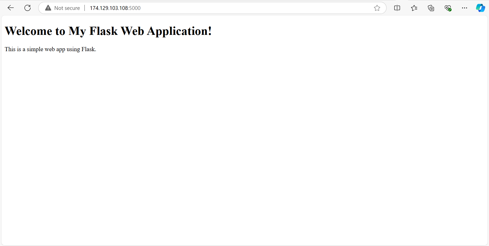

# FLASK-DEMO

This project is a DevSecOps demonstration using Flask, Jenkins, JFrog Artifactory and Trivy for security scanning . It showcases the integration of continuous integration and continuous deployment (CI/CD) practices, emphasizing security throughout the development lifecycle.

## Project Structure

The project structure is as follows:

```
FLASK-DEMO/
│
├── jenkins/
│   ├── ci/
│   │   └── Jenkinsfile       # CI Pipeline
│   ├── cd/
│   │   └── Jenkinsfile       # CD Pipeline
│
├── src/
│   ├── app.py                # Flask app code
│   ├── Dockerfile            # Dockerfile to build the Flask app image
│   ├── requirements.txt      # Python dependencies for the Flask app
│   └── templates/
│       └── index.html        # HTML template for the app
│
└── README.md                 # Project README
```

## Tools Used

1. **Jenkins**: Used for automating the CI/CD process. Two Jenkins pipelines have been set up:
    - **CI Pipeline**: Builds the Docker image, performs security scanning with Trivy, and pushes the image to JFrog Artifactory.
    - **CD Pipeline**: Pulls the Docker image from JFrog Artifactory and deploys the Flask app.

2. **JFrog Artifactory**: A repository manager for storing Docker images. The Docker images built in the CI pipeline are stored here.

3. **Trivy**: A security scanning tool used in the CI pipeline to scan Docker images for vulnerabilities.

4. **Docker**: Used to containerize the Flask app.

5. **Flask**: A lightweight web framework for Python to build the web application.

## CI Pipeline

The CI pipeline is defined in the `jenkins/ci/Jenkinsfile` and follows these steps:

1. **Build Docker Image**: The Flask app is containerized using Docker.
2. **Trivy Security Scan**: The Docker image is scanned for vulnerabilities using Trivy.
3. **JFrog CLI Setup**: The JFrog CLI is downloaded and configured for interaction with Artifactory.
4. **Push to Artifactory**: The Docker image is tagged and pushed to JFrog Artifactory.
5. **Trigger CD Pipeline**: On successful completion, the CD pipeline is triggered to deploy the application.

### Environment Variables in CI Pipeline

- `ARTIFACTORY_URL`: The URL for the JFrog Artifactory.
- `ARTIFACTORY_REPO`: The repository in JFrog to push Docker images.
- `DOCKER_REGISTRY`: The Docker registry (JFrog).
- `IMAGE_NAME`: The name of the Docker image to be built and pushed.
- `ARTIFACTORY_CREDS`: Jenkins credentials for JFrog (username and password).
- `PYTHON_VERSION`: Python version for the Flask app.
- `JFROG_CLI_VERSION`: Version of JFrog CLI used.

### Build Commands

To build the Docker image:
```sh
docker build -t flask-app:<BUILD_NUMBER> -f src/Dockerfile .
```

### Trivy Scanning

The Trivy scan command:
```sh
trivy image --exit-code 1 --severity HIGH,CRITICAL flask-app:<BUILD_NUMBER>
```

## CD Pipeline

The CD pipeline is defined in the `jenkins/cd/Jenkinsfile` and follows these steps:

1. **JFrog CLI Setup**: The JFrog CLI is set up to pull the Docker image.
2. **Pull Docker Image**: The Flask app Docker image is pulled from Artifactory.
3. **Deploy Application**: The Flask app is deployed by running the Docker container.

### Deployment Commands

To pull the Docker image:
```sh
jfrog rt docker-pull <IMAGE_NAME>:<BUILD_NUMBER>
```

To deploy the application using Docker:
```sh
docker run -d -p 5000:5000 <IMAGE_NAME>:<BUILD_NUMBER>
```

## Setup Instructions

### Prerequisites

1. **Jenkins**: Install Jenkins and configure it with the necessary plugins (e.g., Docker, Git, Pipeline).
2. **Docker**: Ensure Docker is installed on the Jenkins server.
3. **JFrog Artifactory**: Set up an instance of JFrog Artifactory and create a Docker repository.
4. **Trivy**: Install Trivy on the Jenkins server for security scanning.
5. **Flask App**: The Flask app dependencies are defined in the `requirements.txt`.

### How to Run

1. **Clone the repository**:
   ```sh
   git clone https://github.com/Jothamcloud/flask-demo.git
   cd flask-demo
   ```

2. **Set up Jenkins Jobs**:
   - Create a Jenkins job for CI (`jenkins/ci/Jenkinsfile`).
   - Create a Jenkins job for CD (`jenkins/cd/Jenkinsfile`).

3. **Trigger the CI Pipeline**: The CI pipeline will:
   - Build the Docker image.
   - Scan it with Trivy.
   - Push the image to JFrog Artifactory.
   - Trigger the CD pipeline.

4. **CD Pipeline**: The CD pipeline will pull the image and deploy the Flask app.

5. **Access the Application**: The Flask app will be accessible on `http://<server-ip>:5000`.

## Security Considerations

- Trivy is configured to fail the build if any HIGH or CRITICAL vulnerabilities are detected.
- Secrets like Artifactory credentials are securely handled using Jenkins credentials.

## Required Ports

To access the application and related services, ensure the following ports are open in your security group:

- Port 5000: For accessing the Flask application
- Port 8080: For accessing Jenkins
- Port 8081: For accessing JFrog Artifactory (if using the default port)
- Port 22: For SSH access to your server (if needed)

Make sure to restrict these ports to trusted IP addresses for enhanced security.

## Application Screenshot

Below is a screenshot of the running Flask application:


